# kTeam Agent — 用户使用手册

> 本手册按技能划分，涵盖 kTeam Agent 的全部能力。在 Slack 中与 Agent 对话、在频道中 @Agent 或使用 Shortcut 即可使用。

---

## 前置说明：Slack 与 Notion

- 在使用 kTeam Agent 之前，请确保已加入 Slack Workspace 和 Notion 团队。
- kTeam Agent 基于 Slack App构建，加入Slack后请配置App使用（参考：https://slack.com/help/articles/360001537467-Guide-to-apps-in-Slack），配置正确后可在slack侧边栏(desktop)或主页列表(mobile)中访问

### 重要链接

**Slack**
- 邀请链接（加入 Workspace）: https://join.slack.com/t/kapibalaai/shared_invite/zt-3sdaz7x78-bW8SYH7EnINRuDUDZ4SCzw
- Slack 帮助 - 加入工作区: https://app.slack.com/slackhelp/zh-CN/212675257
- Slack 新用户指南: https://app.slack.com/slackhelp/zh-CN/218080037
- kTeam Agent

**Slack 频道**
- feedback (反馈): https://app.slack.com/client/T0AKZDWB1RB/C0ALX532TUY
- expense-claim (报销): https://app.slack.com/client/T0AKZDWB1RB/C0AL0S2L0GN
- recruitments (招聘): https://app.slack.com/client/T0AKZDWB1RB/C0ALFQX3U4R
- dashboard (看板): https://app.slack.com/client/T0AKZDWB1RB/C0AN001J2US

**Notion**
- 邀请链接（加入团队）: https://www.notion.so/team/3217523c-7c93-811b-b45f-00429a0920e9/join
- Notion 新手指南: https://www.notion.com/help/category/new-to-notion

**Notion Databases**
- Feedback (反馈)：https://www.notion.so/3217523c7c938087b6dfe6051c0e7006
- Tasks (任务)：https://www.notion.so/3217523c7c9380c2a87df2688fa5f978
- Docs (团队文档)：https://www.notion.so/3217523c7c9380ccb769c9378d18a1a8
- Expense Claims (报销记录)：https://www.notion.so/3217523c7c9380ca90b1c0f60d730e57
- Recruitments (招聘记录)：https://www.notion.so/3217523c7c9380dc870ec790813b6d4e
- Decisions (重要决策记录)：https://www.notion.so/3467523c7c93807bbf44e159d158cd52
- Budget & Finance Tracker (预算管理)：https://www.notion.so/Budget-Finance-Tracker-5ed7523c7c93823996d901e9b93d1fdc

### Slack 使用说明

1. 使用上方邀请链接或公司邮箱加入 Workspace
2. 加入后阅读 [Slack 新用户指南](https://app.slack.com/slackhelp/zh-CN/218080037) 快速上手
3. 加入相关频道（feedback、expense-claim、recruitments、dashboard）以接收通知

### Notion 使用说明

1. 通过上方邀请链接加入 Notion 团队
2. 参考 [Notion 新手指南](https://www.notion.com/help/category/new-to-notion) 了解基本操作
3. 通过上方 Notion Databases 链接可直接访问各数据库查看和处理条目

---

## 目录

1. [反馈提交](#1-反馈提交)
2. [Notion 数据查询](#2-notion-数据查询)
3. [报销提交与审批](#3-报销提交与审批)
4. [候选人录入](#4-候选人录入)
5. [讨论总结 / 会议纪要](#5-讨论总结--会议纪要)
6. [任务管理](#6-任务管理)
7. [预算管理](#7-预算管理)
8. [异常告警（自动）](#8-异常告警自动)
9. [Daily / Weekly 推送（自动）](#9-daily--weekly-推送自动)
10. [Slack 上下文辅助](#10-slack-上下文辅助)

---

## 1. 反馈提交

### 技能名称

对话式提交反馈（Bug / Feature Request / Enhancement）

### 技能说明

用自然语言描述问题或需求，Agent 自动提取结构化字段（标题、类型、优先级、来源、客户、标签等），展示摘要让你确认后写入 Notion Feedback 数据库。提交后自动通知 #feedback 频道。

### 应用场景

- 开发同事发现 Bug：「登录页点确认没反应，客户 A 反馈的，挺急的」
- 产品经理提需求：「加个暗黑模式吧，不急」
- 团队成员提改进建议：「部署流程太慢了，能不能优化一下」
- 性能问题：「页面加载太慢了」
- 安全问题：「发现一个 XSS 漏洞」

### 使用举例

**用户：**
> 登录页点确认没反应，客户 A 反馈的，挺急的

**Agent 回复：**
> 收到，我整理了一下：
> - *标题:* 登录页确认按钮无响应
> - *类型:* Bug Fix
> - *优先级:* P1（客户反馈 + 紧急）
> - *来源:* Customer Feedback
> - *客户:* A
> - *描述:* 登录页点确认没反应
>
> 需要修改吗？确认后我帮你提交到 Notion。

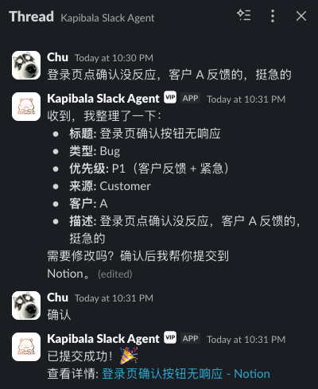

**用户：** 确认

**Agent 回复：**
> 已提交到 Notion：[View in Notion](链接)
> 已通知 #feedback 频道。

### 返回结果说明

- 提交成功：返回 Notion 页面链接
- 提交前：Agent 展示提取的字段摘要，等待用户确认或修改
- 优先级自动推断规则：
  - P0：「blocker」「production down」「can't use the product」
  - P1：「urgent」「挺急的」「客户反馈」「customer reported」
  - P2：普通请求（默认）
  - P3：「nice to have」「不急」「low priority」

### 支持的类型

Feature Request、Enhancement、Bug Fix、Consultation、Documentation、Performance、Security

### 支持的来源

Customer Feedback、Internal Proposal、Market Research、Competitive Analysis、User Testing、Support Tickets、Stakeholder Request

### 支持的标签

Urgent、Key Customer、Technical Debt、Quick Win、Strategic、Compliance、Performance、Security、UX、Integration

---

## 2. Notion 数据查询

### 技能名称

Notion 数据查询（反馈 / 报销 / 招聘 / 任务）

### 技能说明

在 Slack 中直接询问 Agent，即时获得 Notion 数据库中的格式化结果摘要。支持按类型、状态、优先级等维度过滤，所有结果自带 Notion 链接可一键跳转。

### 应用场景

- 查看自己的任务：「我的任务有哪些」
- 查看未处理事项：「有哪些招聘未处理」「报销待审批」「反馈未处理」
- 查看项目状态：「show me all P0 bugs」「recruitment pipeline status」
- 管理者全局视角：「目前有多少待审批的报销？」「Software Engineer 岗位有几个候选人？」

### 使用举例

| 你说 | Agent 查询 |
|---|---|
| 我的任务有哪些 | 查询你被分配的 Task 条目 |
| 有哪些招聘未处理 | 查询 Status = Pending Review 的候选人 |
| 有哪些报销待审批 | 查询 Approval Status = Pending 的报销 |
| 有哪些报销待付款 | 查询 Approval Status = Approved 的报销 |
| 有哪些反馈未处理 | 查询 Status = Pending 的反馈 |
| show me all P0 bugs | 查询 Priority = P0 的 Feedback |

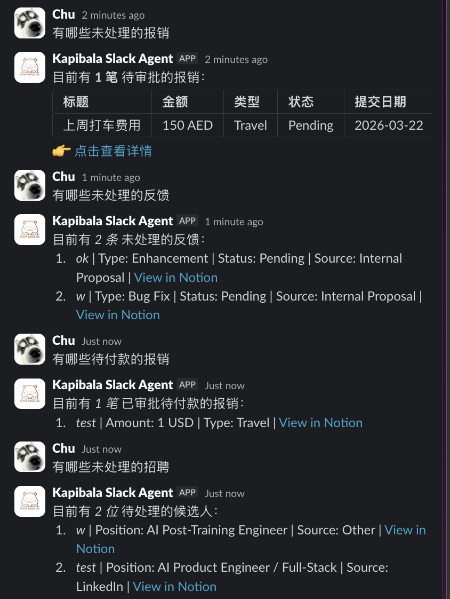

### 返回结果说明

- 格式化列表，每条包含：编号、标题、状态、优先级等关键字段
- 每条结果附带 Notion 链接，点击可跳转查看详情
- 无结果时返回友好提示（如「No pending expense claims.」）

---

## 3. 报销提交与审批

### 技能名称

对话式报销提交 + 审批 + 付款 + 发票上传

### 技能说明

在 Slack 中用一句话提交报销，Agent 追问缺失信息后写入 Notion，同时推送审批消息到 #expense-claims 频道。审批人点击按钮审批，审批通过后自动通知付款人，付款人确认付款后通知申请人。全流程在 Slack 中闭环完成。所有金额单位为 USD。

### 配置说明

- 默认审核人和付款人为 `@tracy`
- 可在对话中指定其他处理人，例如：「我要报销打车 150，审批人 @sam」

### 应用场景

- 出差回来随手报销：「我要报销上周打车 150」
- 采购报销：「报销一台显示器 300，Equipment」
- 团建餐费：「报销昨天团队午餐 80」
- 办公用品：「报销纸笔 50，Office Supplies」

### 使用举例

**用户：**
> 我要报销上周打车 150

**Agent 回复：**
> 收到，我整理了一下：
> - *标题:* 上周打车费用
> - *描述:* 上周打车 150
> - *金额:* $150
> - *类型:* Travel
>
> 确认后我帮你提交，审批人会在 #expense-claims 频道收到通知。

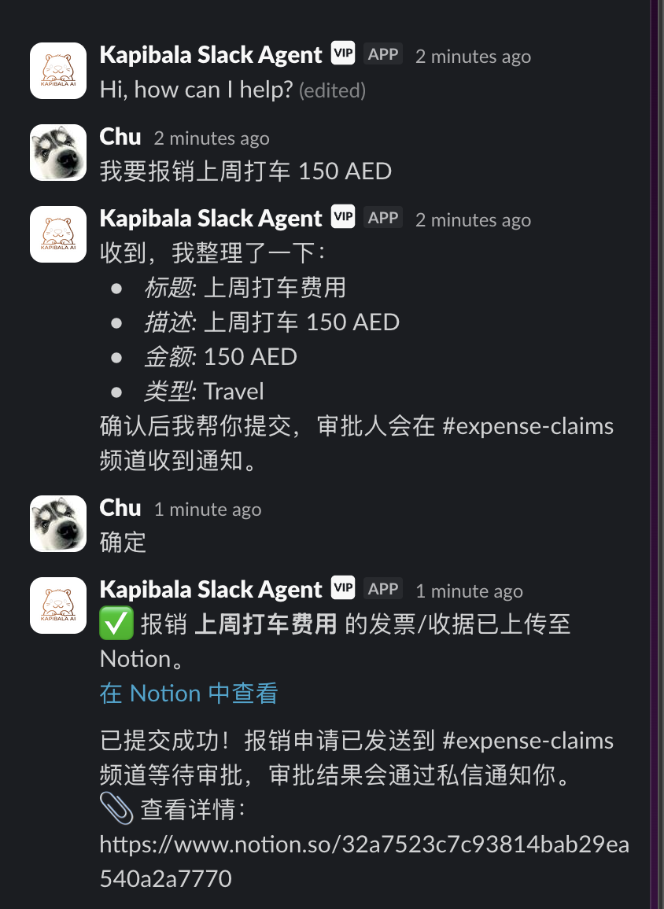

**用户：** 确认

**Agent 回复：**
> 报销已提交：[View in Notion](链接)
> 审批人已收到通知，审批结果会通过 DM 通知你。

### 审批流程

审批人在 #expense-claims 频道看到审批消息，包含 Approve / Reject 按钮：

**审批人点击 Approve：**
- 更新 Notion 中 Approval Status = Approved
- DM 通知提交者：「你的报销已批准」
- 通知付款人付款（附带 Pay 按钮）

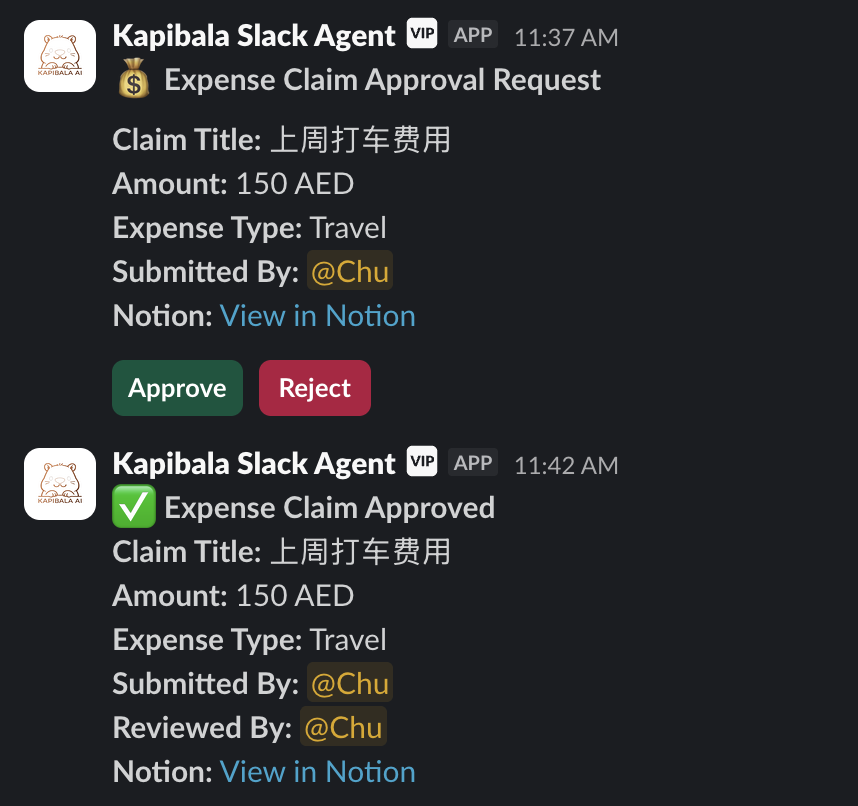

**付款人点击 Pay：**
- 弹出 Modal，填写付款方式和日期
- 更新 Notion 中的 Payment Method / Date 字段

**付款完成后：**
- DM 通知申请人：「你的报销已付款」
- 自动同步到 Expenses 数据库（关联预算分类 + 月份）

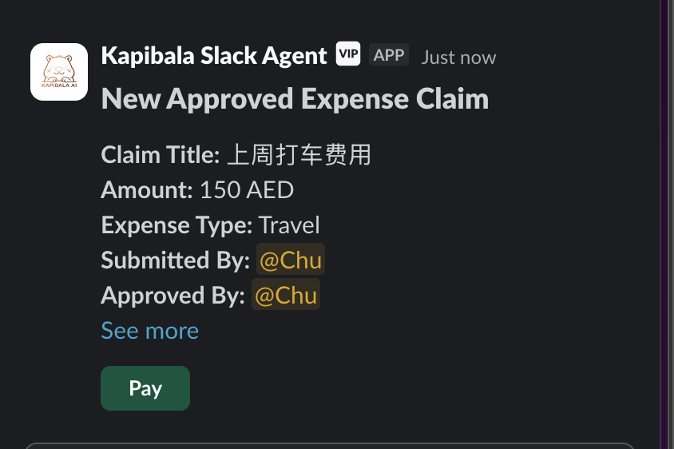

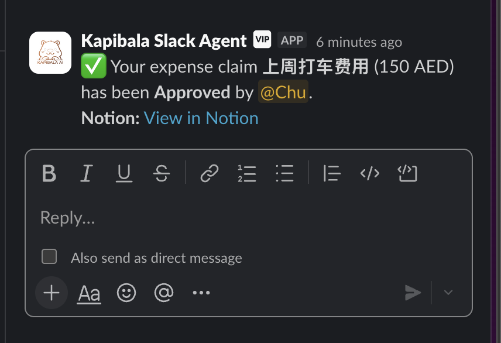

### 返回结果说明

- 提交成功：返回 Notion 链接 + 发票上传按钮（可上传最多 5 个文件）
- 审批结果：通过 DM 通知提交者（Approved / Rejected）
- 付款完成：通过 DM 通知申请人

### 支持的支出类型

Travel、Office Supplies、Entertainment、Training、Meals、Equipment、Other

### 流程

```
员工提交报销（对话 / Modal）
    │
    ▼
Agent 写入 Notion（Approval Status: Pending）
    │
    ▼
推送审批消息到 #expense-claims（Approve / Reject 按钮）
    │
    ├─ Reject → DM 通知提交者「已拒绝」
    │
    └─ Approve → 更新 Notion Approval Status = Approved
                    │
                    ▼
              DM 通知提交者「已批准」
                    │
                    ▼
              通知付款人（Pay 按钮）
                    │
                    ▼
              付款人点击 Pay → 填写付款方式 + 日期
                    │
                    ▼
              更新 Notion（Payment Method / Date）
                    │
                    ▼
              DM 通知申请人「已付款」
                    │
                    ▼
              自动同步到 Expenses 数据库（关联预算分类 + 月份）
```

---

## 4. 候选人录入

### 技能名称

对话式录入候选人

### 技能说明

在 Slack 中提到候选人信息，Agent 自动提取姓名、职位、来源、联系方式、面试时间等字段，确认后写入 Notion 招聘数据库。提交后自动通知 #recruitments 频道和 Interviewer。

### 配置说明

- 默认招聘处理人为 `@tracy`
- 可在对话中指定其他处理人，例如：「录入候选人张三，处理人 @sam」

### 应用场景

- HR 在群里说：「有个候选人叫张三，应聘 Software Engineer，LinkedIn 上看到的」
- 面试官推荐：「推荐一个候选人李四，Product Manager，邮箱 lisi@example.com」
- 安排面试：「张三面试时间定在 4月5日」

### 使用举例

**用户：**
> 有个候选人叫张三，应聘 Software Engineer，简历是 LinkedIn 上看到的，邮箱 zhangsan@example.com

**Agent 回复：**
> 收到，我整理了一下：
> - *候选人:* 张三
> - *应聘职位:* Software Engineer
> - *简历来源:* LinkedIn
> - *邮箱:* zhangsan@example.com
>
> 确认后我帮你录入到 Notion。

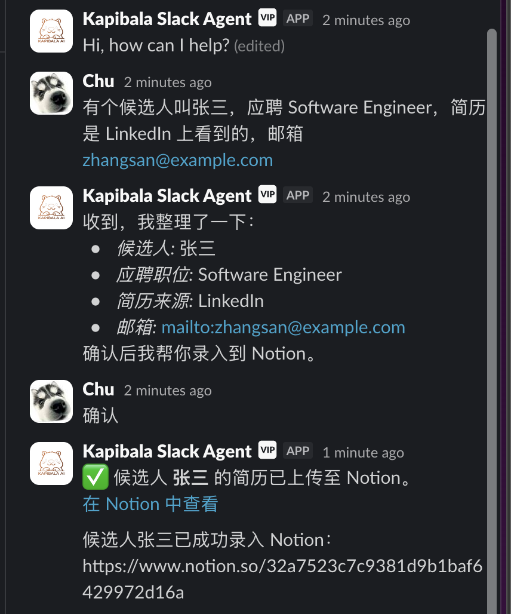

**用户：** 确认

**Agent 回复：**
> 候选人已录入：[View in Notion](链接)
> 点击下方按钮上传简历附件。
> 已通知 #recruitments 频道。

### 返回结果说明

- 录入成功：返回 Notion 链接 + 简历上传按钮（可上传 PDF 或链接）
- 自动通知 #recruitments 频道（含候选人详情）
- 自动 DM 通知 Interviewer 有新候选人

### 支持的职位

AI Post-Training Engineer、AI Product Engineer / Full-Stack、International Business Development、Software Engineer、Product Manager、UX Designer、HR Specialist

### 支持的简历来源

LinkedIn、Xiaohongshu、Email、Liepin、Other

---

## 5. 讨论总结 / 会议纪要

### 技能名称

讨论固化 / 会议纪要生成

### 技能说明

在频道中 @Agent 即可总结讨论内容。支持按时间范围、话题关键词、特定发言人组合过滤。Agent 生成结构化总结（背景、要点、决策、待办、参与者），并提供「Save to Notion」按钮一键归档到 Notion Docs 数据库。

### 应用场景

- 技术讨论结束后归档决策：「@agent 总结今天关于 agent 架构的讨论」
- 会议结束后生成纪要：「@agent 总结今天的讨论」
- 查看某人发言要点：「@agent 总结今天 @hcs 的发言」
- 按时间范围总结：「@agent 总结本周的讨论」

### 使用举例

**用户（在频道中）：**
> @agent 总结今天关于 agent 架构的讨论

**Agent 回复：**
> **Agent 架构讨论总结 2026-03-31**
>
> **背景：** 团队讨论了 Agent 的工具调用架构和 HITL 流程优化...
>
> **要点：**
> 1. 工具调用改为并行执行，减少响应延迟
> 2. HITL 审批流程统一使用 defineHook 模式
> ...
>
> **决策：** 采用方案 A，下周开始实施
>
> **待办：**
> - @hcs：完成工具并行化 POC（4/3）
> - @tracy：更新 PRD 文档（4/2）
>
> **参与者：** hcs, tracy, jacob
>
> [Save to Notion] [Cancel]

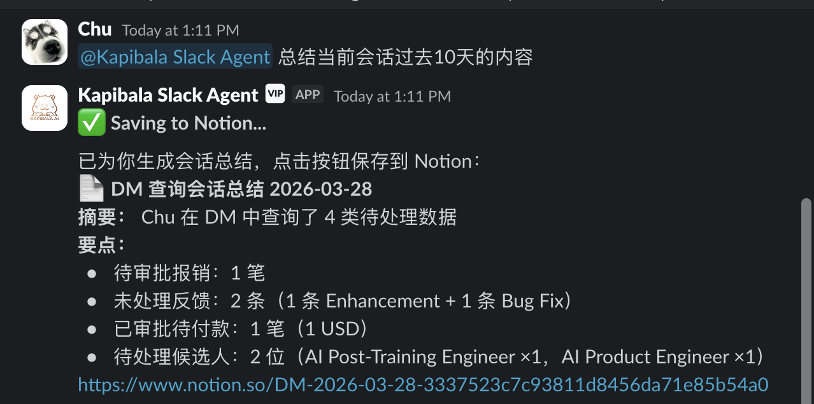

**用户点击 Save to Notion**

**Agent 回复：**
> 已保存到 Notion：[View in Notion](链接)

### 返回结果说明

- 结构化总结包含 5 个部分：背景、要点、决策、待办、参与者
- 点击「Save to Notion」后写入 Docs 数据库，返回 Notion 链接
- 点击「Cancel」则不保存
- 文档自动关联作者（Author）和分类（Category）

### 支持的分类

Tech Spec、PRD、Guide、Best Practices、Architecture

### 流程

```
用户在频道 @Agent 发送总结指令
    │
    ▼
Agent 获取频道/thread 消息（支持时间、用户、话题过滤）
    │
    ▼
Agent 生成结构化总结并展示
    │
    ▼
显示 [Save to Notion] / [Cancel] 按钮
    │
    ├─ Cancel → 不保存，流程结束
    │
    └─ Save to Notion → 写入 Notion Docs 数据库
                              │
                              ▼
                        返回 Notion 链接
```

---

## 6. 任务管理

### 技能名称

对话式任务管理（创建 / 更新 / 进度报告）

### 技能说明

在 Slack 中对话式创建任务、更新任务进度、生成任务进度表。所有操作实时同步 Notion Tasks 数据库。支持通过 @mention、姓名、邮箱分配任务，被分配人自动收到 DM 通知。

### 应用场景

- 分配任务：「创建一个任务：B1，名称：PG schema 设计，分配给 @hcs，截止日期：4月1日，优先级高」
- 更新进度：「更新任务 B1，进度：wa-bridge.ts 落库，实机验证通过」
- 标记完成：「更新任务 C1，已完成」
- 生成报告：「@agent 生成今天的任务进度表」

### 使用举例

#### 创建任务

**用户：**
> 创建一个任务：B1，名称：PG schema 设计，说明：wa-bridge.ts 落库，分配给 @hcs，截止日期：4月1日，优先级高

**Agent 回复：**
> 收到，我整理了一下：
> - *任务编号:* B1
> - *名称:* PG schema 设计
> - *说明:* wa-bridge.ts 落库
> - *负责人:* @hcs
> - *截止日期:* 2026-04-01
> - *优先级:* High
>
> 确认后我帮你创建到 Notion。

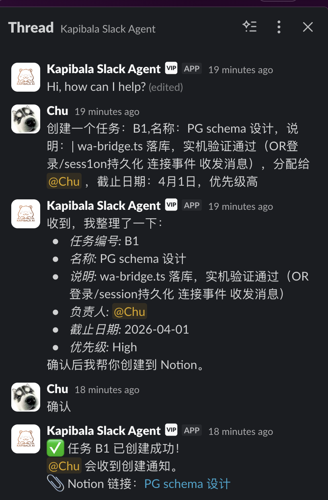

**用户：** 确认

**Agent 回复：**
> 任务 B1 - PG schema 设计 已创建：[View in Notion](链接)
> @hcs 已收到 DM 通知。

#### 更新任务

**用户：**
> 更新任务 B1，进度：wa-bridge.ts 落库，实机验证通过

**Agent 回复（无需确认，直接更新）：**
> 任务 B1 - PG schema 设计 已更新，状态：In Progress。[View in Notion](链接)

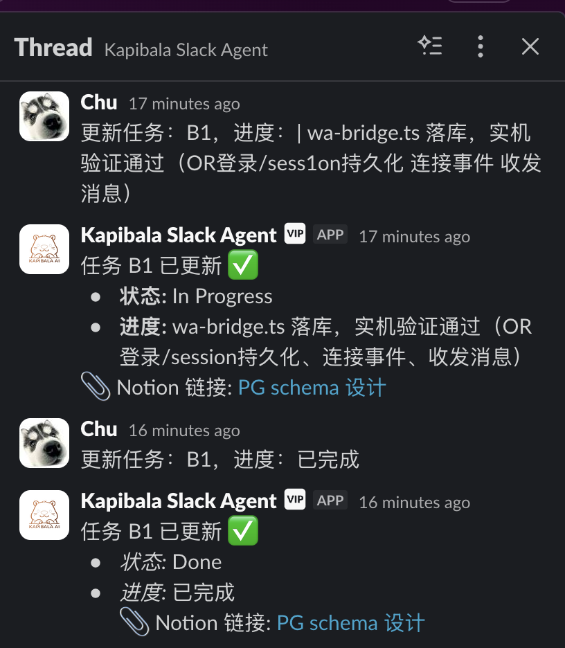

#### 标记完成

**用户：**
> 更新任务 C1，已完成

**Agent 回复：**
> 任务 C1 - API 接口开发 已更新，状态：Done。[View in Notion](链接)

#### 生成进度表

**用户：**
> @agent 生成今天的任务进度表

**Agent 回复：**
> ## 任务进度表 - 2026-03-31
>
> | 日期 | # | 任务 | 状态 | 今日进展 |
> |---|---|---|---|---|
> | 03-31 | B1 | PG schema 设计 | 🔵 进行中 | wa-bridge.ts 落库，实机验证通过 |
> | 03-31 | C1 | API 接口开发 | ✅ 完成 | 全部接口联调通过 |
> | 03-30 | A2 | 需求文档 | ⬜ 未开始 | - |
>
> **总进度：1/3 完成（33%）**
>
> 已同步到 Notion：[View in Notion](链接)

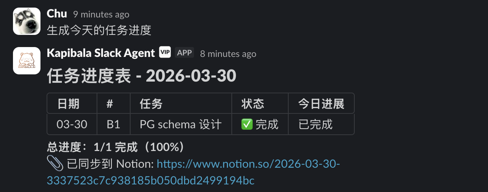

### 返回结果说明

- 创建任务：返回 Notion 链接，被分配人收到 DM 通知
- 更新任务：返回 Notion 链接，进度追加到 Log 字段（带时间戳 `[YYYY-MM-DD]`）
- 进度表：Markdown 表格 + 完成统计，自动同步到 Notion Docs 数据库并返回链接
- 状态自动推断：
  - 说「done」「完成」「已完成」「100%」→ Status = Done
  - 有进度更新但未完成 → Status = In Progress
- 人员匹配支持三种方式：
  - @mention（如 `@hcs`）
  - 姓名（如「分配给 Chu」）
  - 邮箱（如「分配给 hcs@example.com」）

### 进度表示例

| 日期 | # | 任务 | 状态 | 今日进展 |
|---|---|---|---|---|
| 03-31 | B1 | PG schema 设计 | 🔵 进行中 | wa-bridge.ts 落库，实机验证通过 |
| 03-31 | C1 | API 接口开发 | ✅ 完成 | 全部接口联调通过 |
| 03-30 | A2 | 需求文档 | ⬜ 未开始 | - |

**总进度：1/3 完成（33%）**

---

## 7. 预算管理

### 技能名称

对话式预算管理（更新预算 / 添加支出 / 查询状态）

### 技能说明

在 Slack 中管理团队预算和支出。支持更新月度预算金额、添加支出记录（自动推断分类）、查询预算使用状态（已花费、占比）。所有数据实时同步 Notion Budget / Expenses 数据库。金额单位为 USD。

### 应用场景

- 更新预算：「更新预算，人力资源，1000」
- 添加支出：「添加支出，MacBook，200」
- 查询单分类：「查看本月人力资源预算」
- 查询全局：「本月总支出」
- 查询明细：「查看本月设备支出」

### 使用举例

#### 更新预算

**用户：**
> 更新预算，人力资源，1000

**Agent 回复（直接执行，无需确认）：**
> Human Resources 预算已更新为 $1,000。[View in Notion](链接)

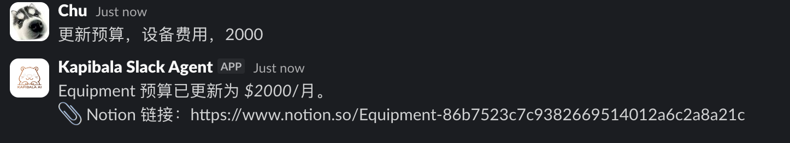

#### 添加支出

**用户：**
> 添加支出，MacBook，200

**Agent 回复：**
> 收到，我整理了一下：
> - *支出:* MacBook
> - *金额:* $200
> - *分类:* Equipment Purchases
>
> 确认后我帮你记录。

**用户：** 确认

**Agent 回复：**
> 支出 MacBook ($200) 已记录到 Equipment Purchases，月份：March 2026。[View in Notion](链接)

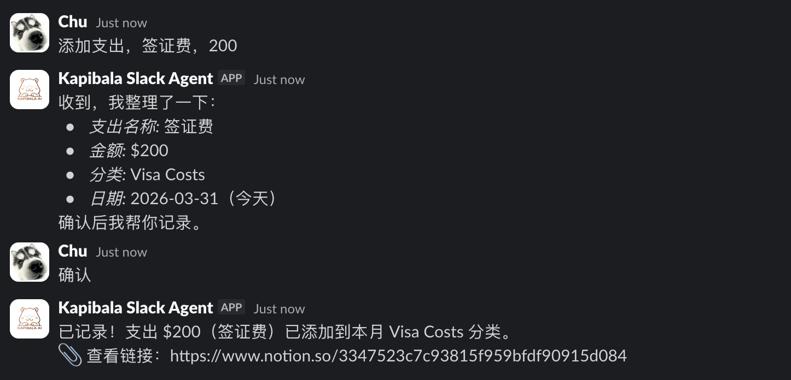

#### 查询预算

**用户：**
> 查看本月人力资源预算

**Agent 回复：**
> **Human Resources — March 2026**
> - 月度预算：$1,000
> - 已花费：$650
> - 占比：65%
> [View in Notion](链接)

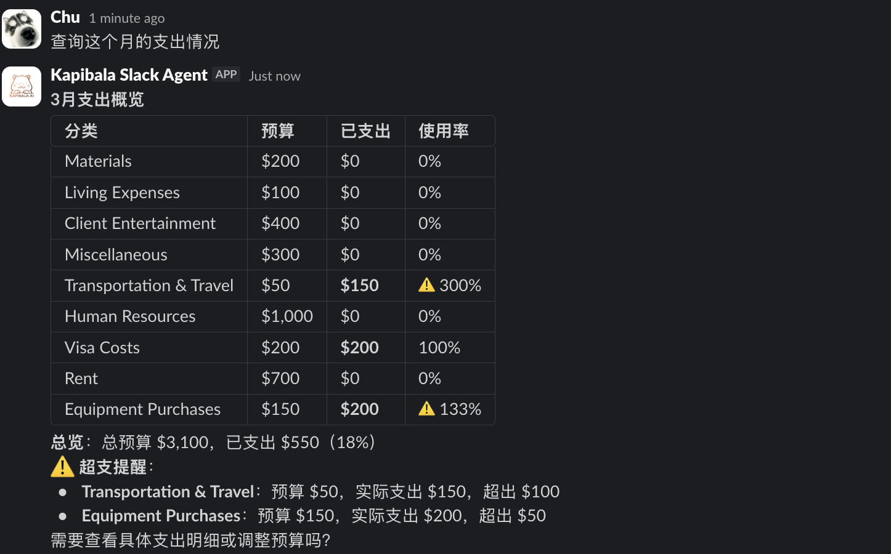

**用户：**
> 本月总支出

**Agent 回复：**
> **March 2026 预算总览**
> 1. Human Resources | Budget: $1,000 | Spent: $650 | 65%
> 2. Equipment Purchases | Budget: $2,000 | Spent: $200 | 10%
> 3. Transportation & Travel | Budget: $500 | Spent: $150 | 30%
> ...
> **总预算：$8,000 | 总支出：$1,500 | 总占比：19%**

### 返回结果说明

- 更新预算：返回更新后的金额 + Notion 链接
- 添加支出：返回支出名称、金额、分类、月份 + Notion 链接
- 查询单分类：返回预算金额、已花费、占比 + Notion 链接
- 查询全局：返回所有分类汇总列表 + 总预算/总支出/总占比

### 预设预算分类（中英文对照）

| 中文 | 英文（Notion 中使用） |
|---|---|
| 人力资源 | Human Resources |
| 房租 | Rent |
| 生活费 | Living Expenses |
| 签证 | Visa Costs |
| 物料 | Materials |
| 设备 | Equipment Purchases |
| 杂费 | Miscellaneous |
| 交通/差旅 | Transportation & Travel |
| 客请 | Client Entertainment |

### 支出分类自动推断规则

| 你说 | Agent 推断分类 |
|---|---|
| MacBook / 电脑 / 显示器 | Equipment Purchases |
| 打车 / 机票 / 差旅 | Transportation & Travel |
| 房租 / 租金 | Rent |
| 工资 / 社保 | Human Resources |
| 签证 / 工签 | Visa Costs |
| 物料 / 耗材 | Materials |
| 水电 / 生活费 | Living Expenses |
| 请客 / 宴请 | Client Entertainment |
| 其他 | Miscellaneous |

---

## 8. 异常告警（自动）

### 技能名称

超期事项异常告警

### 技能说明

系统定时自动检查 Notion 中超过 3 天未处理的事项，推送告警到 #dashboard 频道。无需用户手动触发。无超期项时不推送。

### 应用场景

- 报销提交 5 天还没审批 → 告警提醒审批人
- 候选人等待面试安排超过 3 天 → 告警提醒 HR
- 客户反馈提交一周未处理 → 告警提醒负责人

### 告警规则

| 告警类型 | 触发条件 | 超期计算基准 |
|---|---|---|
| 🔴 报销待审批 | Approval Status = Pending 且超 3 天 | 提交日期 |
| 🟡 报销待付款 | Approval Status = Approved 且超 3 天 | 提交日期 |
| 👤 招聘未处理 | Status = Pending Review 且超 3 天 | 面试时间 |
| 💬 反馈未处理 | Status = Pending 且超 3 天 | 创建日期 |

### 返回结果说明

告警消息推送到 #dashboard，包含：
- 分类标题（如「Expense: Pending Approval >3 Days」）
- 每条告警：Notion 链接、金额/职位、提交人、超期天数
- 底部时间戳

---

## 9. Daily / Weekly 推送（自动）

### 技能名称

每日待办摘要 + 每周统计报告

### 技能说明

系统定时从 Notion 聚合数据，自动推送到 #dashboard 频道。无需用户手动触发。

### 推送内容

**Daily Digest（每日）**
- 未处理报销（Approval Status = Pending）
- 待付款报销（Approval Status = Approved）
- 未处理招聘（Current Status = Pending Review）
- 未处理反馈（Status = Pending）

**Weekly Report（每周一）**
- 本周反馈统计（数量、按类型/优先级分布）
- 本周报销统计（数量、金额汇总）
- 本周招聘统计（数量、按职位/状态分布）

### 返回结果说明

Block Kit 格式化消息，推送到 #dashboard 频道，包含数量统计和 Notion 链接。

---

## 10. Slack 上下文辅助

### 技能名称

频道消息读取 / Thread 上下文理解 / 频道搜索与加入

### 技能说明

Agent 能读取频道消息和 Thread 上下文来回答问题，支持搜索频道和加入频道（需人工审批）。

### 应用场景

- 「刚才讨论了什么？」→ Agent 读取 Thread 上下文后回答
- 「这个频道最近在聊什么？」→ Agent 读取频道消息后总结
- 「帮我找一下 #design 频道」→ Agent 搜索频道
- 「加入这个频道」→ Agent 发起加入请求（需审批）

### 使用举例

**用户：**
> 刚才大家讨论了什么？

**Agent 回复：**
> 根据 Thread 上下文，刚才讨论了以下内容：
> 1. @hcs 提出了数据库 schema 的修改方案
> 2. @tracy 确认了 API 接口的变更范围
> ...

### 返回结果说明

- 消息读取：Agent 基于上下文生成回答
- 频道搜索：返回匹配的频道列表
- 加入频道：弹出 Approve / Reject 按钮，审批通过后 Agent 加入频道

---

## Slack Shortcuts（快捷方式）

除了对话式交互，kTeam Agent 还支持通过 Slack Shortcut 快速打开 Modal 表单提交信息。三种 Shortcut 可在 Slack 快捷菜单中触发：

### New Feedback

- **Shortcut ID:** `new_feedback`
- **Modal 字段：**
  - Title（标题）- 文本输入
  - Type（类型）- 下拉选项：Feature Request、Enhancement、Bug Fix、Consultation、Documentation、Performance、Security
  - Description（描述）- 多行文本
  - Source（来源）- 下拉选项：Customer Feedback、Internal Proposal、Market Research、Competitive Analysis、User Testing、Support Tickets、Stakeholder Request
  - Customer（客户）- 文本输入（可选）
  - Tags（标签）- 多选下拉：Urgent、Key Customer、Technical Debt、Quick Win、Strategic、Compliance、Performance、Security、UX、Integration（可选）
  - Attachments（附件）- 文件上传（最多 5 个，可选）

### Expense Claim

- **Shortcut ID:** `expense_claim`
- **Modal 字段：**
  - Claim Title（报销标题）- 文本输入
  - Claim Description（报销描述）- 多行文本
  - Amount (USD)（金额）- 数字输入，支持小数
  - Expense Type（支出类型）- 下拉选项：Travel、Office Supplies、Entertainment、Training、Meals、Equipment、Other
  - Attachments（附件）- 文件上传（最多 5 个，可选）

### New Candidate

- **Shortcut ID:** `new_candidate`
- **Modal 字段：**
  - Candidate Name（候选人姓名）- 文本输入
  - Position Applied（应聘职位）- 下拉选项：AI Post-Training Engineer、AI Product Engineer / Full-Stack、International Business Development、Software Engineer、Product Manager、UX Designer、HR Specialist
  - Resume Link（简历链接）- URL 输入（可选）
  - Resume（简历）- 文件上传（最多 1 个，可选）
  - Resume Source（简历来源）- 下拉选项：LinkedIn、Xiaohongshu、Email、Liepin、Other
  - Phone（电话）- 文本输入（可选）
  - Email（邮箱）- 邮箱输入（可选）
  - Interview Time（面试时间）- 日期选择器（可选）
  - Zoom Meeting Link（Zoom 链接）- URL 输入（可选）

---

## 快速参考

### 需要确认后执行的操作

| 操作 | 需要确认 |
|---|---|
| 提交反馈 | ✅ 是 |
| 提交报销 | ✅ 是 |
| 录入候选人 | ✅ 是 |
| 创建任务 | ✅ 是 |
| 添加支出 | ✅ 是 |
| 保存文档到 Notion | ✅ 是（按钮确认） |
| 更新任务进度 | ❌ 否（直接执行） |
| 更新预算 | ❌ 否（直接执行） |
| 查询类操作 | ❌ 否（直接返回结果） |

### 触发方式

| 方式 | 适用场景 |
|---|---|
| DM 对话 | 提交反馈、报销、候选人、任务管理、预算管理、查询 |
| 频道 @Agent | 讨论总结、任务进度表、所有 DM 支持的功能 |
| Slack Shortcut | New Feedback / Expense Claim / New Candidate（Modal 表单） |
| 自动定时 | Daily Digest / Weekly Report / 异常告警 |
